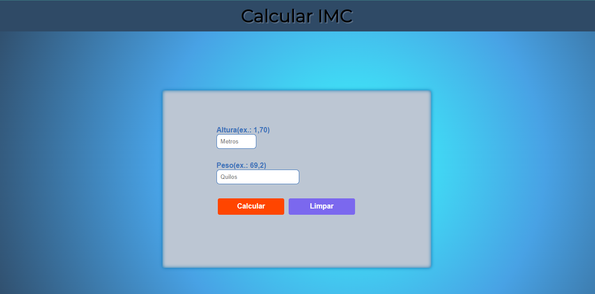
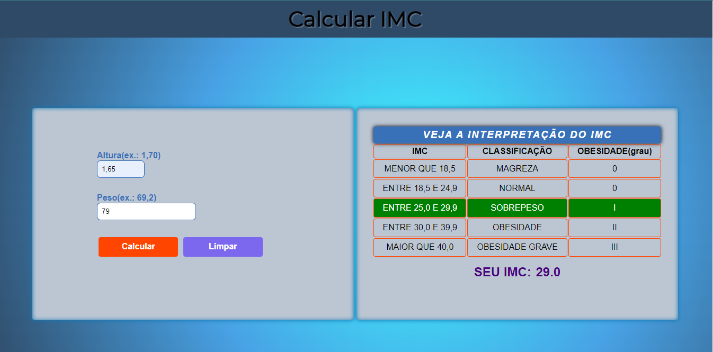

# Calculadora IMC ⚖

####  <a href="">Clique aqui para ver seu IMC.</a>

Calcule Seu Imc e Veja a Classificação:

<ul>
  <li>Magreza</li>
  <li>Normal</li>
  <li>Sobrepeso</li>
  <li>Obesidade</li>
  <li>Obesidade Grave</li>
</ul> 

### !! Esse Programa calcula o imc de adultos, entao informe a Altura em Metros (ex: 1.65)

## Conheça o Programa

## Funcionalidade

1 - Se os campos estiverem vazios ou com 0, um alerta aparecera pedindo para informar um valor valido.

 2 - Ao clicar em Calcular e acionado e evento Click no JavaScript, se os Campos Estiverem Preenchidos Corretamente O JavaScript exibirar o Resultado.

3 - Apos a validação dos Campos o Programa exibe uma tabela com a classificação e abaixo da tabela e exibido Seu IMC.

4 - O limpar zera os campos onde e Inserido a Altura e Peso.

5 - Ao calcular outro valor a tabela se mantem, se o resultado não for o mesmo a cor verde da classificação e alterada para o novo resultado.

